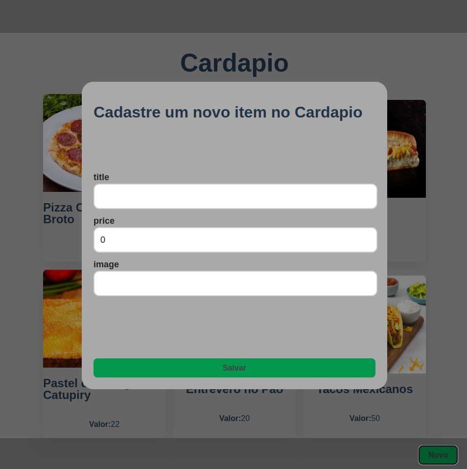

# Cardápio Digital
# 🚧 Sobre o Projeto

Uma aplicação Fullstack desenvolvida através de um treinamento no Youtube disponibilizado pela [Fernanda Kipper](https://github.com/Fernanda-Kipper).
Nesta projeto foi desenvolvido o Backend utilizando Java, aplicando recursos como Spring e Spring MVC para criação do servidor. Também utilizamos Spring Data JPA para manipulação de dados.
O DB utilizado foi o PostgreSQL, sendo necessário a uso do Postgres Driver para conexão do mesmo.
O Frontend e apenas um protótipo simples, nesta aplicação utilizamos React e seus Hooks, Typescript e React Query.

<h1 align="center">
    
    
</h1>

# 📋 Requisitos

- Java (JDK 17)
- PostgreSQL (DB food)
- Node JS (v18.16.0)
- Npm (9.5.1)

# 🖧 EndPoints
Podem ser importados no Postman através do arquivo Cardapio.postman_collection.json disponibilizado nesse projeto.
#### GET Foods
```
http://localhost:8080/food
```
#### POST Food
```
http://localhost:8080/food

#Body:
{
    "title": "Hamburguer Artesanal",
    "image": "https://supermercadosrondon.com.br/guiadecarnes/images/postagens/quer_fazer_hamburger_artesanal_perfeito_2019-05-14.jpg",
    "price": 45
}
```
#### DELETE Food (Em desenvolvimento)
```
http://localhost:8080/food/2
```

# 🔙 Como executar o Backend
O projeto já possui o Backend e Frontend, abaixo veremos o processo para executar apenas o Backend da aplicação. Lembrando que sera necessário ter o PostgreSQL previamente instalado, as configurações devem ser adicionadas no application.properties .
```
# Criar uma pasta para salvar o projeto
mkdir /home/seunomeusuario/git

# Acessar a pasta para salvar
cd /home/seunomeusuario/git

# Clonar repositório
git clone https://github.com/mauricioinhaia/cardapio.git

# Acessar pasta para executar
cd cardapio/backend/

# Executar o Projeto
./mvnw spring-boot:run
```

# 🚪 Como executar o Frontend
Como a pasta do Frontend já foi baixada no processo anterior, basta acessar a pasta e executar:
```
# Acessar pasta para executar
cd /home/seunomeusuario/git/cardapio/frontend/

# Instalar Dependecias para Execucao
npm install

# Executar o Projeto
npm run dev
```
# Autor
[Mauricio Inhaia](https://www.linkedin.com/feed/ "LinkedIn")
